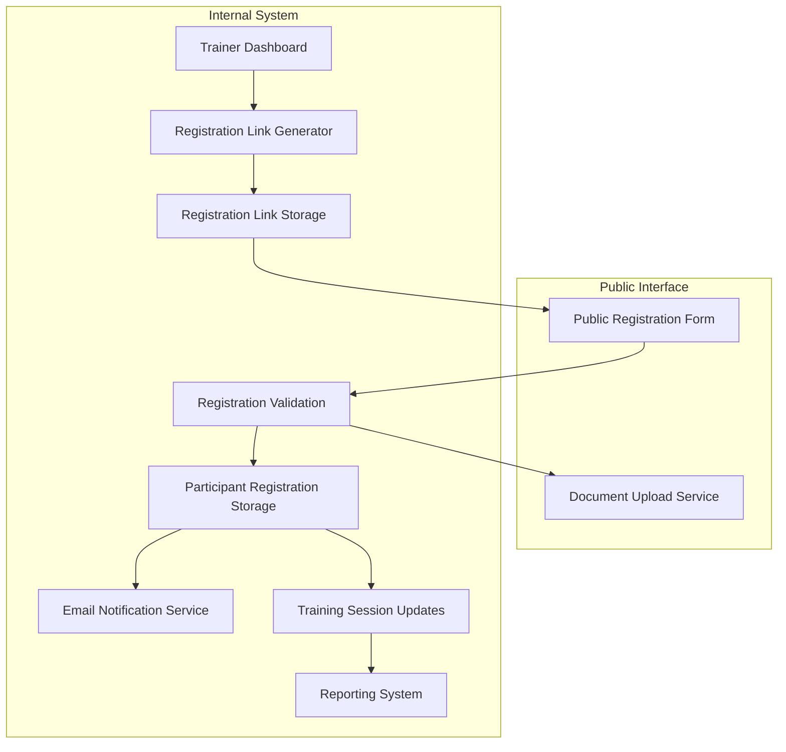

# Design Document

## Overview

The Participant Self-Registration feature extends the existing training management system to enable public registration through shareable links. This feature introduces a new public-facing registration flow while maintaining integration with the existing participant management, training session management, and reporting systems.

The design leverages the current Supabase backend architecture and React frontend, adding new components for link generation, public registration forms, and enhanced participant tracking capabilities.

## Architecture

### System Components



### Data Flow

1. **Link Generation**: Trainer selects training session → System generates secure token → Link stored with session association
2. **Registration Access**: Participant clicks link → System validates token → Registration form displayed with training details
3. **Registration Submission**: Participant submits form → System validates data → Documents uploaded (if required) → Registration stored → Confirmation sent
4. **System Integration**: Registration updates participant count → Attendance tracking enabled → Reporting data available

## Components and Interfaces

### 1. Registration Link Management

#### RegistrationLinkGenerator Component
```typescript
interface RegistrationLinkGeneratorProps {
  trainingSessionId: string;
  onLinkGenerated: (link: string) => void;
}
```

**Responsibilities:**
- Generate secure registration links for training sessions
- Display existing links if already generated
- Provide copy-to-clipboard functionality
- Show link analytics (views, registrations)

#### RegistrationLinkService
```typescript
interface RegistrationLinkService {
  generateLink(sessionId: string): Promise<RegistrationLink>;
  validateLink(token: string): Promise<TrainingSession | null>;
  getLinkAnalytics(linkId: string): Promise<LinkAnalytics>;
  deactivateLink(linkId: string): Promise<void>;
}
```

### 2. Public Registration Interface

#### PublicRegistrationForm Component
```typescript
interface PublicRegistrationFormProps {
  registrationToken: string;
  onRegistrationComplete: (registration: ParticipantRegistration) => void;
}
```

**Responsibilities:**
- Display training session information
- Collect participant details with validation
- Handle conditional baby-related fields and document uploads
- Show attendance implications for in-person training
- Process form submission with error handling

#### DocumentUploadService
```typescript
interface DocumentUploadService {
  uploadDocument(file: File, registrationId: string, documentType: string): Promise<UploadResult>;
  validateDocument(file: File): Promise<ValidationResult>;
  getUploadedDocuments(registrationId: string): Promise<Document[]>;
}
```

### 3. Registration Management

#### ParticipantRegistrationService
```typescript
interface ParticipantRegistrationService {
  createRegistration(data: RegistrationData): Promise<ParticipantRegistration>;
  validateRegistration(data: RegistrationData): Promise<ValidationResult>;
  checkDuplicateRegistration(email: string, sessionId: string): Promise<boolean>;
  getRegistrationsBySession(sessionId: string): Promise<ParticipantRegistration[]>;
}
```

#### EmailNotificationService
```typescript
interface EmailNotificationService {
  sendRegistrationConfirmation(registration: ParticipantRegistration): Promise<void>;
  sendTrainingReminder(registration: ParticipantRegistration, daysBeforeTraining: number): Promise<void>;
}
```

## Data Models

### Registration Link
```typescript
interface RegistrationLink {
  id: string;
  training_session_id: string;
  token: string; // Secure, unique token
  is_active: boolean;
  expires_at: string;
  created_by: string;
  created_at: string;
  updated_at: string;
}
```

### Participant Registration
```typescript
interface ParticipantRegistration {
  id: string;
  registration_link_id: string;
  training_session_id: string;
  participant_name: string;
  mobile_number: string;
  email_address: string;
  participant_position: string;
  fcp_number: string;
  fcp_name: string;
  cluster: string;
  region: string;
  attending_with_baby: boolean;
  nanny_approval_document?: string; // File path
  waiver_document?: string; // File path
  attendance_confirmed: boolean;
  registration_reference: string; // Unique reference number
  registered_at: string;
  created_at: string;
  updated_at: string;
}
```

### Registration Link Analytics
```typescript
interface LinkAnalytics {
  link_id: string;
  total_views: number;
  unique_views: number;
  total_registrations: number;
  conversion_rate: number;
  last_accessed: string;
}
```

### Document Upload
```typescript
interface UploadedDocument {
  id: string;
  registration_id: string;
  document_type: 'nanny_approval' | 'waiver_liability';
  file_name: string;
  file_path: string;
  file_size: number;
  mime_type: string;
  uploaded_at: string;
}
```

## Error Handling

### Registration Link Validation
- **Invalid Token**: Display user-friendly error with contact information
- **Expired Link**: Show expiration message with trainer contact details
- **Training Past**: Prevent registration with clear messaging
- **Link Deactivated**: Display appropriate message

### Form Validation
- **Required Fields**: Real-time validation with clear error messages
- **Email Format**: Validate email format and check for duplicates
- **Mobile Number**: Validate format based on regional requirements
- **File Upload**: Validate file types, sizes, and required documents
- **Network Issues**: Offline capability with retry mechanisms

### System Integration
- **Database Errors**: Graceful error handling with user feedback
- **Email Delivery**: Retry mechanisms for failed notifications
- **File Storage**: Backup storage options and error recovery

## Testing Strategy

### Unit Testing
- Registration link generation and validation logic
- Form validation functions
- Document upload utilities
- Email notification services
- Data transformation functions

### Integration Testing
- End-to-end registration flow
- Database operations and data consistency
- File upload and storage integration
- Email service integration
- Training session updates

### User Acceptance Testing
- Public registration form usability
- Mobile responsiveness
- Document upload functionality
- Email notifications and confirmations
- Trainer link management interface

### Security Testing
- Registration link token security
- File upload security (malware scanning)
- Input validation and sanitization
- Rate limiting on registration endpoints
- Access control for trainer functions

## Security Considerations

### Registration Link Security
- **Secure Token Generation**: Use cryptographically secure random tokens
- **Token Expiration**: Automatic expiration based on training date
- **Rate Limiting**: Prevent abuse of registration endpoints
- **Access Logging**: Track link access for security monitoring

### Data Protection
- **Input Sanitization**: Validate and sanitize all user inputs
- **File Upload Security**: Scan uploaded files for malware
- **Data Encryption**: Encrypt sensitive participant data at rest
- **GDPR Compliance**: Implement data retention and deletion policies

### System Security
- **Authentication**: Secure trainer authentication for link generation
- **Authorization**: Role-based access to registration management
- **Audit Logging**: Track all registration-related activities
- **Backup and Recovery**: Secure backup of registration data

## Performance Considerations

### Scalability
- **Database Indexing**: Optimize queries for registration lookups
- **File Storage**: Use CDN for document storage and retrieval
- **Caching**: Cache training session details for public forms
- **Load Balancing**: Handle high registration volumes during peak times

### User Experience
- **Form Performance**: Optimize form loading and submission
- **Mobile Optimization**: Ensure smooth mobile registration experience
- **Offline Capability**: Allow form completion during network issues
- **Progress Indicators**: Show upload and submission progress

## Integration Points

### Existing System Integration
- **Training Sessions**: Update participant counts and lists
- **Participant Management**: Create or update participant records
- **Attendance Tracking**: Enable attendance recording for registered participants
- **Reporting System**: Include registration data in reports
- **Email System**: Leverage existing notification infrastructure

### External Services
- **File Storage**: Supabase Storage for document uploads
- **Email Service**: Supabase Auth for email notifications
- **SMS Service**: Optional SMS notifications for mobile numbers
- **Analytics**: Track registration conversion rates and user behavior

## Deployment Strategy

### Database Changes
- Create new tables for registration links, participant registrations, and documents
- Add indexes for performance optimization
- Set up foreign key relationships with existing tables
- Implement database migration scripts

### Frontend Deployment
- Add new public routes for registration forms
- Update trainer dashboard with link generation features
- Implement responsive design for mobile registration
- Add new components to existing component library

### Backend Services
- Deploy new API endpoints for registration functionality
- Set up file upload and storage services
- Configure email notification services
- Implement security middleware and rate limiting

### Monitoring and Analytics
- Set up registration conversion tracking
- Monitor system performance during high-volume periods
- Track user experience metrics for public forms
- Implement error monitoring and alerting